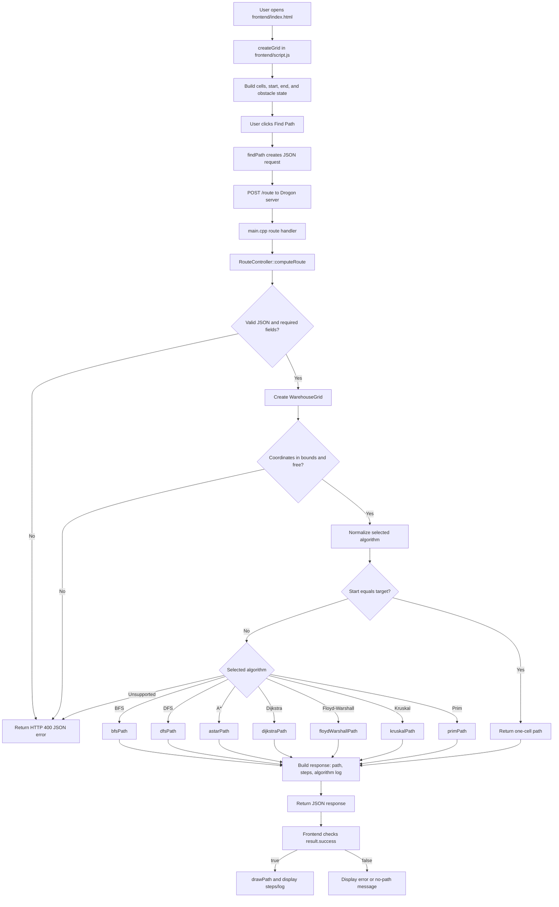

# Code Flow



## Request/response flow

1. `frontend/script.js` stores the grid size, start/end cells, and obstacles.
2. `findPath()` sends those values plus the algorithm name to `POST /route`.
3. `main.cpp` forwards the request to `RouteController::computeRoute()`.
4. The controller validates input and converts obstacles into a `WarehouseGrid`.
5. It calls the corresponding algorithm function in `algorithm/`.
6. The resulting `vector<Cell>` becomes a JSON `path`, with `steps` and an explanation log.
7. The frontend draws the returned path and updates the status panel.

## Core data flow

```text
Grid form + clicked obstacles
        -> JavaScript request JSON
        -> RouteController validation
        -> WarehouseGrid (free cells / blocked cells)
        -> Pathfinding algorithm
        -> vector<Cell> path
        -> JSON response
        -> browser path rendering
```
