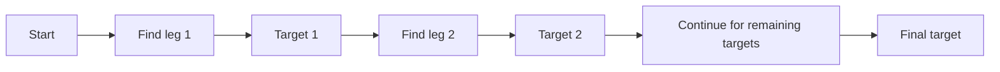
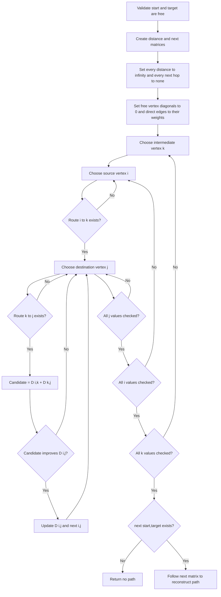
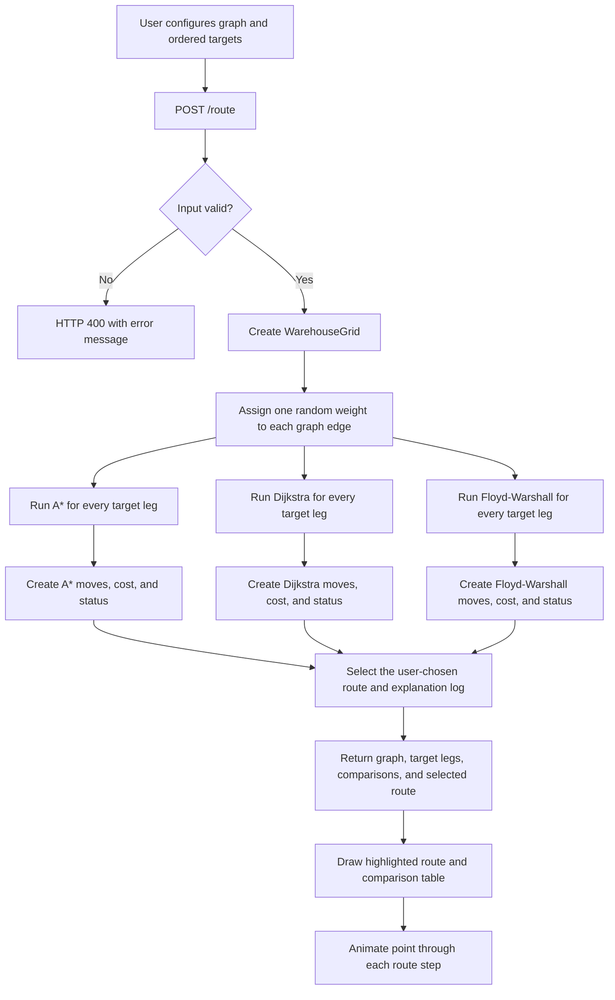

# Project Report: Warehouse Route Graph Optimizer

## 1. Introduction

The Warehouse Route Graph Optimizer is a C++17 web application for comparing shortest-path algorithms on a weighted two-dimensional route graph. A free location is a graph vertex; an edge joins two orthogonally adjacent free locations. A blocked location is removed from the traversable graph.

The system implements and compares exactly three algorithms:

- A* Search
- Dijkstra's Algorithm
- Floyd–Warshall Algorithm

The user selects a start location, up to eight ordered targets, and blocked locations. For one request, the server generates edge weights once and runs every algorithm against that exact same graph. This makes the comparison table fair: a difference in moves or cost is caused by the algorithm's route choice, not by different graph data.

## 2. Project Objectives

1. Find a valid route from a start location through every target in the chosen order.
2. Find minimum-cost routes on positive weighted edges.
3. Compare A*, Dijkstra, and Floyd–Warshall using one shared graph per request.
4. Show the selected route on the graph and animate a marker through every step.
5. Explain the selected algorithm through formulas, route steps, and flowcharts.
6. Provide a JSON API that can be used by the browser or another client.

## 3. System Architecture

```text
Browser frontend
       |
       | POST /route (dimensions, start, targets, obstacles, selected algorithm)
       v
RouteController
       |
       +--> validates coordinates and target order
       |
       +--> WarehouseGrid creates one weighted graph
       |
       +--> A*          ┐
       +--> Dijkstra    ├--> route summaries and comparison data
       +--> Floyd-Warshall┘
       |
       v
JSON: graph, selected path, target legs, comparison table, explanation log
       |
       v
Graph rendering, route animation, and comparison table
```

| Module | Main responsibility |
|---|---|
| `graph/warehousegrid.*` | Stores free/blocked locations and gives every free edge a random weight from 1 to 9. |
| `algorithm/astar.*` | Finds a route using travelled cost plus a heuristic estimate. |
| `algorithm/grid_shortest_paths.*` | Contains Dijkstra and Floyd–Warshall implementations. |
| `controllers/RouteController.cpp` | Validates input, runs all three algorithms on one graph, and creates the API response. |
| `frontend/script.js` | Draws the graph, animates the chosen route, and fills the comparison table. |

## 4. Graph Model

For `R` rows and `C` columns, a location is represented by coordinate `(x, y)` where:

```text
0 <= x < R
0 <= y < C
```

Each free location is a vertex. An undirected edge exists only between free orthogonal neighbours:

```text
(x, y) <-> (x + 1, y)
(x, y) <-> (x, y + 1)
```

Diagonal movement is not allowed. Every edge has a positive random weight:

```text
1 <= w(u, v) <= 9
```

### Key graph-model points

- Positive weights make Dijkstra valid.
- The lowest possible edge weight is 1, which makes Manhattan distance an admissible A* heuristic.
- Obstacles do not appear as nodes or edges in the returned graph.
- The graph is randomized once per `/route` request, then shared by all three algorithms in the comparison.
- The graph is undirected, so every allowed connection works in both directions.

## 5. Ordered Targets and Route Legs

The application does not reorder targets. It solves them in the user's order:

```text
start -> target 1 -> target 2 -> ... -> target n
```

Each arrow is one route leg. The destination of one leg becomes the start of the next leg. The full route is made by joining the legs without repeating the connecting target location.



### Key points

- One to eight targets are supported.
- If any leg cannot reach its next target, that algorithm reports failure for the complete ordered route.
- `targetPaths` in the API contains the individual legs; `path` contains the joined route.
- The comparison table reports totals across all completed legs: total moves and total weighted cost.

## 6. Algorithm Comparison Summary

| Property | A* | Dijkstra | Floyd–Warshall |
|---|---|---|---|
| Main strategy | Best-first search with heuristic | Greedy relaxation by current minimum distance | Dynamic programming through every intermediate vertex |
| Required edge weights | Non-negative; this app uses 1–9 | Non-negative; this app uses 1–9 | No negative cycles; this app uses 1–9 |
| Route result | Minimum cost | Minimum cost | Minimum cost |
| Best use in this project | Fast point-to-point route with useful heuristic | Reliable single-source weighted route | Small graphs or all-pairs distance analysis |
| Time complexity | Typically `O(V log V)` | `O((V + E) log V)` | `O(V^3)` |
| Space complexity | `O(V)` | `O(V)` | `O(V^2)` |

> **Important:** minimum cost and minimum number of moves are different concepts. The comparison table shows both. A route with more moves can be cheaper if its edge weights are lower.

## 7. A* Search

### 7.1 Purpose

A* finds a minimum-cost path from the current location to the current target. It directs its search toward the target using a heuristic, so it often examines fewer vertices than Dijkstra on the same graph.

### 7.2 Formula and notation

```text
f(n) = g(n) + h(n)
g(n) = known edge-cost from the leg start to n
h(n) = |x(n) - x(target)| + |y(n) - y(target)|
f(n) = estimated total cost of a route through n
```

`g(n)` uses the displayed random edge weights. `h(n)` is Manhattan distance, the smallest possible number of orthogonal steps remaining.

Because each edge costs at least 1, the remaining travel cost cannot be smaller than the number of remaining orthogonal steps. Therefore `h(n)` never overestimates the remaining cost.

### 7.3 Data structures used by the implementation

| Structure | Purpose |
|---|---|
| `gScore[row][col]` | Best known cost from the leg start to a location. |
| `closed[row][col]` | Marks a location after its best route has been finalized. |
| `parent[row][col]` | Stores the previous location for route reconstruction. |
| priority queue | Always removes the node with the smallest `f(n)`. |

### 7.4 Pseudocode

```text
set every gScore to infinity
set start.gScore = 0
push start into priority queue with f(start) = h(start)

while priority queue is not empty:
    current = pop node with smallest f

    if current is target:
        rebuild path by following parent pointers backward
        return path

    if current is already closed:
        continue
    mark current closed

    for every orthogonal free neighbour next of current:
        if next is closed:
            continue

        candidate = gScore[current] + weight(current, next)
        if candidate < gScore[next]:
            gScore[next] = candidate
            parent[next] = current
            f = candidate + ManhattanDistance(next, target)
            push next into priority queue

return no path
```

### 7.5 A* flowchart

```mermaid
flowchart TD
    A[Validate start and target are free] --> B[Set all gScore values to infinity]
    B --> C[Set gScore(start) = 0 and push start]
    C --> D{Priority queue empty?}
    D -- Yes --> E[Return no path]
    D -- No --> F[Pop node with lowest f = g + h]
    F --> G{Is this the target?}
    G -- Yes --> H[Follow parent pointers and return path]
    G -- No --> I{Already closed?}
    I -- Yes --> D
    I -- No --> J[Mark current node closed]
    J --> K[Inspect four orthogonal neighbours]
    K --> L{Free, in bounds, and not closed?}
    L -- No --> K
    L -- Yes --> M[Compute candidate g = current g + edge weight]
    M --> N{candidate g improves gScore?}
    N -- No --> K
    N -- Yes --> O[Store parent and push neighbour with f = g + h]
    O --> K
```

### 7.6 A* key points

- A* uses both the actual known cost and a target-direction estimate.
- The implementation allows several queue entries for a node; stale entries are ignored after the node is closed.
- The heuristic must remain admissible. Manhattan distance is valid here because diagonal movement is not allowed and each edge costs at least 1.
- A* returns an empty route when no free connection exists to the target.
- For a fixed target order, A* is run once for every route leg.

## 8. Dijkstra's Algorithm

### 8.1 Purpose

Dijkstra finds a minimum-cost path from the current location to the current target without using a heuristic. It is the baseline weighted shortest-path algorithm in this project.

### 8.2 Relaxation rule

```text
candidateDistance = distance[current] + weight(current, neighbour)
distance[neighbour] = min(distance[neighbour], candidateDistance)
```

Updating a neighbour when `candidateDistance` is smaller is called **relaxation**.

### 8.3 Data structures used by the implementation

| Structure | Purpose |
|---|---|
| `distance[id]` | Lowest known cost from the leg start to vertex `id`. |
| `parent[id]` | Previous vertex on the best known route. |
| min-priority queue | Stores `(distance, vertexId)` and removes the lowest distance first. |
| cell ID mapping | Converts `(x, y)` to `x * cols + y` for compact arrays. |

### 8.4 Pseudocode

```text
set every distance to infinity
set distance[start] = 0
push (0, start) into min-priority queue

while priority queue is not empty:
    (currentDistance, current) = pop lowest-distance entry

    if currentDistance is not distance[current]:
        continue                  // stale queue entry
    if current is target:
        stop searching

    for every orthogonal free neighbour next of current:
        candidate = currentDistance + weight(current, next)
        if candidate < distance[next]:
            distance[next] = candidate
            parent[next] = current
            push (candidate, next)

if target has no parent and start != target:
    return no path
otherwise:
    rebuild path from target through parent pointers
```

### 8.5 Dijkstra flowchart

```mermaid
flowchart TD
    A[Validate start and target are free] --> B[Set all distances to infinity]
    B --> C[Set distance(start) = 0 and push start]
    C --> D{Priority queue empty?}
    D -- Yes --> E[No route found]
    D -- No --> F[Pop smallest current distance]
    F --> G{Entry matches current best distance?}
    G -- No: stale entry --> D
    G -- Yes --> H{Is current the target?}
    H -- Yes --> I[Reconstruct route from parent array]
    H -- No --> J[Inspect four orthogonal neighbours]
    J --> K{Neighbour is free?}
    K -- No --> J
    K -- Yes --> L[Candidate = current distance + edge weight]
    L --> M{Candidate improves neighbour distance?}
    M -- No --> J
    M -- Yes --> N[Update distance and parent; push neighbour]
    N --> J
```

### 8.6 Dijkstra key points

- Dijkstra does not need a heuristic; it only trusts finalized lowest distances.
- It is correct only when no edge has a negative weight. All application weights are positive.
- The priority queue can contain older entries. The implementation detects them by comparing the popped distance with `distance[current]`.
- The first finalized route to the target is minimum cost.
- Dijkstra is useful as a reference against A* because both should return the same total cost for the same graph and target order.

## 9. Floyd–Warshall Algorithm

### 9.1 Purpose

Floyd–Warshall computes shortest paths between every pair of vertices, not only one start-target pair. The application then reconstructs the required route from the completed matrices.

### 9.2 Dynamic-programming rule

For every possible intermediate vertex `k`, determine whether a route from `i` to `j` becomes cheaper by travelling through `k`:

```text
D[i][j] = min(D[i][j], D[i][k] + D[k][j])
```

The implementation also stores `next[i][j]`, the next vertex to use when travelling from `i` toward `j`.

### 9.3 Data structures used by the implementation

| Structure | Purpose |
|---|---|
| `distance[i][j]` | Current minimum cost from vertex `i` to vertex `j`. |
| `next[i][j]` | First next-hop vertex for reconstructing a route from `i` to `j`. |
| `kInfinity` | A large value that represents no known connection. |
| cell ID mapping | Maps each coordinate to a matrix row and column. |

### 9.4 Pseudocode

```text
for every vertex i:
    for every vertex j:
        distance[i][j] = infinity
        next[i][j] = none

for every free vertex u:
    distance[u][u] = 0
    for every free neighbour v of u:
        distance[u][v] = weight(u, v)
        next[u][v] = v

for each intermediate vertex k:
    for each source vertex i:
        if distance[i][k] is infinity:
            continue
        for each destination vertex j:
            if distance[k][j] is infinity:
                continue
            candidate = distance[i][k] + distance[k][j]
            if candidate < distance[i][j]:
                distance[i][j] = candidate
                next[i][j] = next[i][k]

if next[start][target] is none and start != target:
    return no path

start path with start
repeat current = next[current][target] until current is target
return path
```

### 9.5 Floyd–Warshall flowchart



### 9.6 Floyd–Warshall key points

- It solves all-pairs shortest paths even though the interface currently displays only the requested route legs.
- Its matrix approach is easy to reason about but uses much more memory than A* or Dijkstra.
- Blocked locations receive no usable direct edges, so they cannot appear in a reconstructed route.
- The implementation skips infinity entries before addition, which avoids invalid paths and prevents overflow.
- Use it on small route graphs. Its cubic time grows quickly as the graph size increases.

## 10. Shared Comparison Flow

The following flow describes one `/route` request. The important design decision is that `randomizeWeights()` runs once before all algorithm calls.



### Comparison-table key points

| Table field | Interpretation |
|---|---|
| Status | `Route found` means the algorithm reached every ordered target. |
| Moves | Number of edges in the joined route. |
| Cost | Sum of all displayed edge weights in the joined route. |
| Selected row | The algorithm chosen in the dropdown; this is the route drawn and animated. |

- All three rows use identical obstacles, start, targets, graph edges, and edge weights.
- New requests create new random weights. Compare rows from the same table, not from different requests.
- With correct implementations, all successful algorithms should have the same minimum total cost for a fixed target order. Their exact route shapes may differ when equal-cost alternatives exist.

## 11. API Documentation

### `POST /route`

#### Request fields

| Field | Type | Meaning |
|---|---|---|
| `rows` | integer | Number of graph rows; must be positive. |
| `cols` | integer | Number of graph columns; must be positive. |
| `start` | `[x, y]` | Starting location. |
| `targets` | `[[x, y], ...]` | One to eight destinations, visited in order. |
| `end` | `[x, y]` | Legacy single destination; accepted when `targets` is omitted. |
| `obstacles` | `[[x, y], ...]` | Blocked locations. |
| `algorithm` | string | Selected route visualization: `A*`, `Dijkstra`, or `Floyd-Warshall`. |

#### Successful response fields

| Field | Meaning |
|---|---|
| `success` | Whether the selected algorithm reached all targets. |
| `algorithm` | Selected algorithm name. |
| `steps` | Total moves in the selected route. |
| `cost` | Total weighted cost in the selected route. |
| `path` | Joined selected route as ordered `[x, y]` coordinates. |
| `targetPaths` | Individual selected route legs. |
| `comparisons` | Status, moves, and cost for A*, Dijkstra, and Floyd–Warshall on the same graph. |
| `graph` | Returned nodes and weighted edges used for the comparison. |
| `algorithmLog` | Formula-based explanation for the selected route. |
| `message` | Human-readable success or failure result. |

## 12. Build and Run

```bash
cmake -S . -B build
cmake --build build
./build/server
```

Open `http://127.0.0.1:8080` in a browser. Configure the graph, choose a selected algorithm, and click **Find Routes**. The route, simulation, and comparison table will appear in the same graph workspace.

## 13. Limitations and Future Work

- Floyd–Warshall requires `O(V^2)` memory and `O(V^3)` time, so it is suitable only for small graphs.
- Edge weights are randomized for each new request. They are fixed only within that request's comparison.
- Target order is supplied by the user; the system does not solve a travelling-salesperson optimization problem.
- The marker animates the final route, not every internal queue or matrix update. A future version can animate algorithm exploration as well.

## 14. Conclusion

The project provides a fair, visual comparison of A*, Dijkstra, and Floyd–Warshall. The report documents their formulae, data structures, pseudocode, correctness conditions, complexity, and execution flow. The application adds ordered targets, a shared weighted graph, a route simulation, and a same-graph comparison table to make the results easy to understand.
